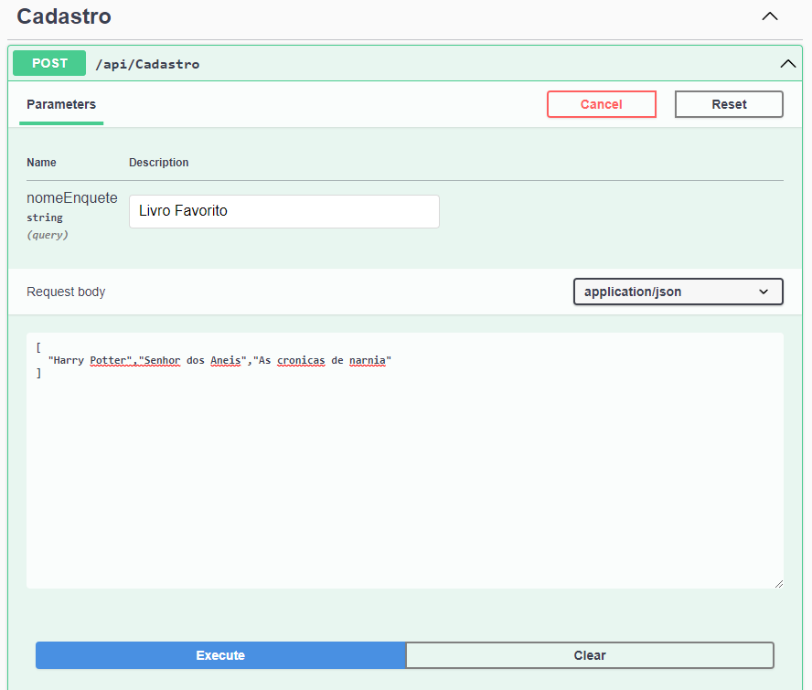
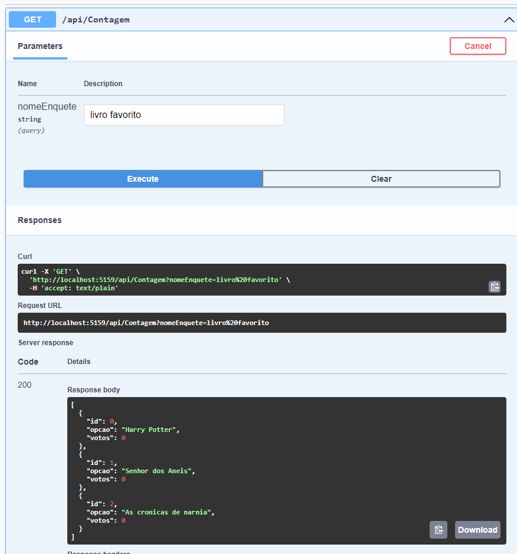
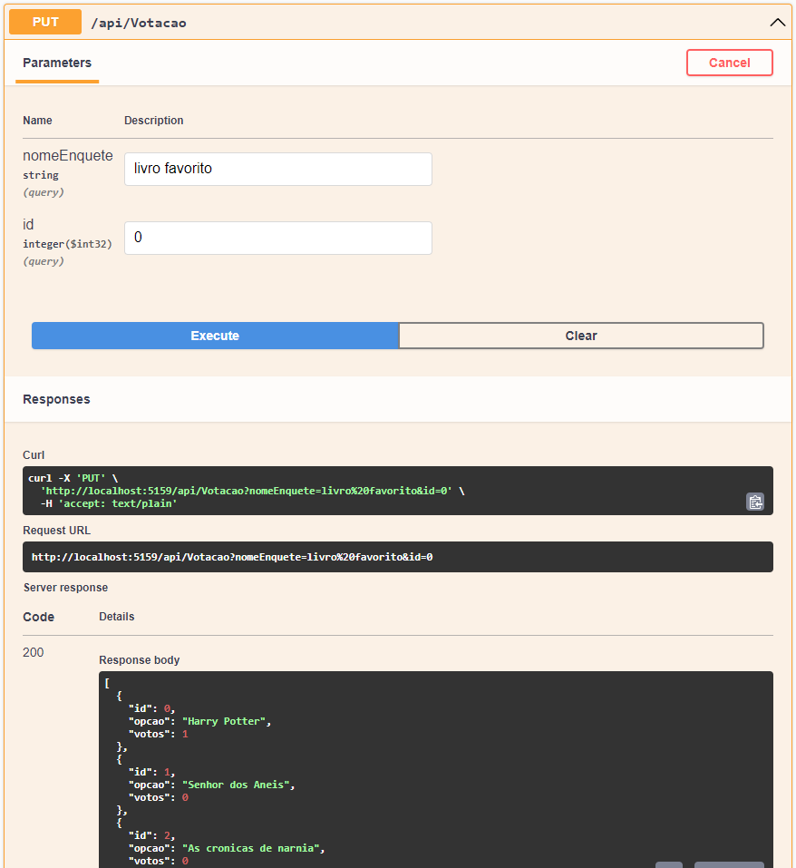
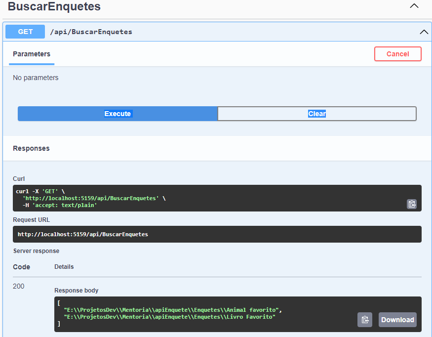

<body>
    <h1 align="center">API criada para prática de Serialização de arquivos.</h1>
    
Utilizando a linguagem de programção C# e documentação em swagger.

    
O projeto consiste em criar uma API que possa cadastrar e gerir enquetes.

    
    <h2>Cadastro de Enquete</h2>
    
Para o cadastro é necessário passar como parametro o título para a enquete no campo designado e porfim a array com os candidatos a voto.

    
    
    <h2>Contagem</h2>
    
Sabendo o nome das enquetes em andamento, é possivel fazer a busca pelo nome dela e verificar quais são os itens mais votados.

    
    
    <h2>Votação</h2>
    
Para adicionar o voto em uma enquete é necessário saber o nome da enquete e o ID do candidato a voto. Assim, preenche os campos desejados para adicionar o voto.

    

    <h2>Verificar Enquetes</h2>
    
Quando não souber as enquetes que estão acontecendo, pode utilizar o campo de buscar enquetes. Nele não é necessário nenhum parametro. Apenas executando ele faz uma varredura e dispobiliza o nome das enquetes que estão ativas.

    
    
    
Obs: Projeto criado em .net 7.0

    
Para rodar o projeto em seu computador, basta fazer o download deste repositório

    
Para iniciar o swagger utilizar o cli: "dotenet watch run"

</body>